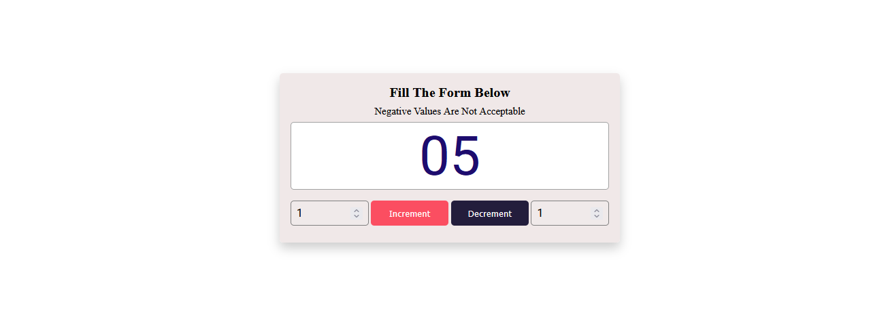

# Controlled Increment-Decrement Counter

A simple yet smart counter application built with HTML, CSS, and JavaScript. This app allows users to increment or decrement a number using custom input values while enforcing basic validation rules such as preventing negative values.

*** Features

* Increment and decrement the counter using user-defined steps.
* Prevents negative values and displays alerts if attempted.
* Automatically resets input fields to default value (`1`) after each action.
* Minimal and clean UI with number formatting (e.g., `01`, `02`, ...).

## 📸 Preview

*** Technologies Used

- HTML5
- CSS3
- JavaScript (Vanilla)

** Project Structure

 # How to Use

    Clone the repository:

    git clone https://github.com/IamPial/controlled-increment-decrement-counter.git

    Open index.html in your browser.

    Enter the increment or decrement value and click the respective button.

# Rules

    Counter will not go below 0.

    Alert message is shown if a decrement results in a negative value.

    Values less than 10 are prefixed with a 0.

📄 License

This project is open-source and available under the MIT License.
